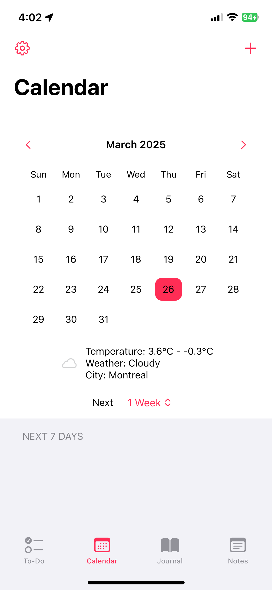
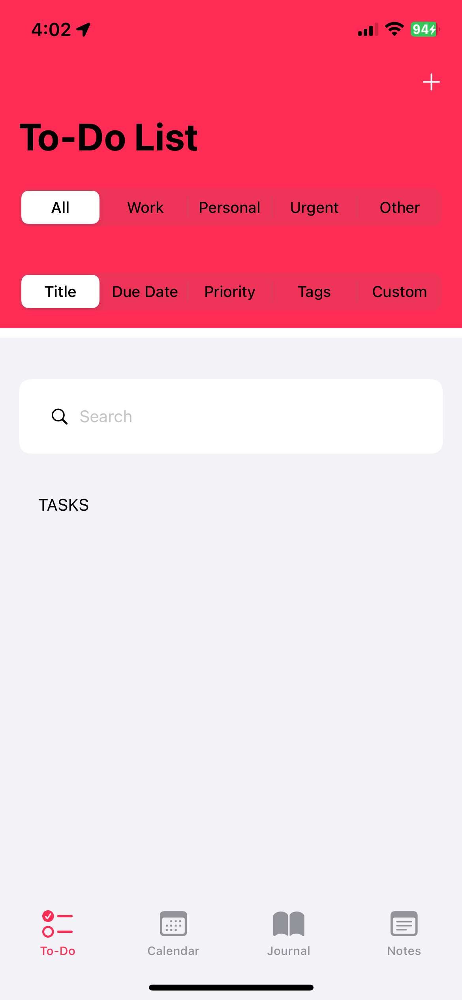
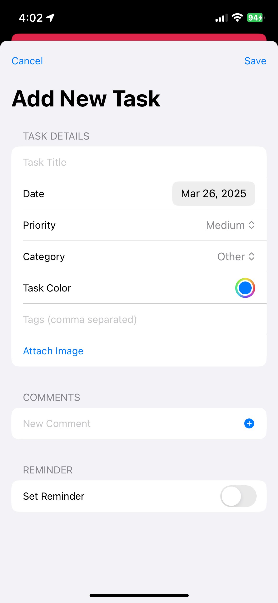
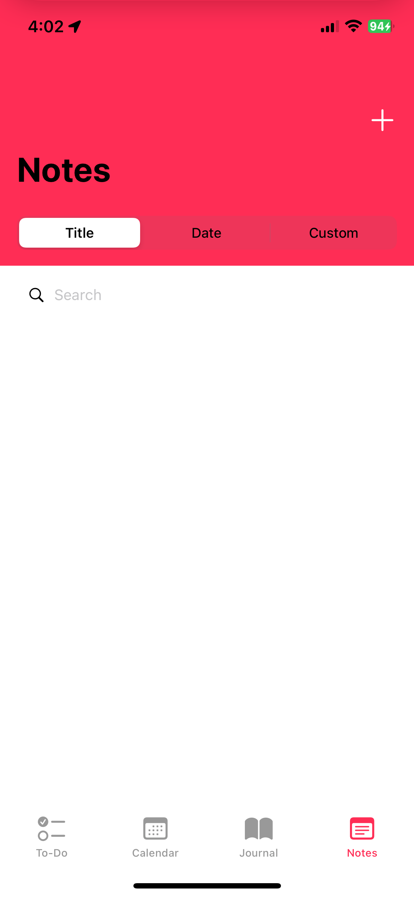
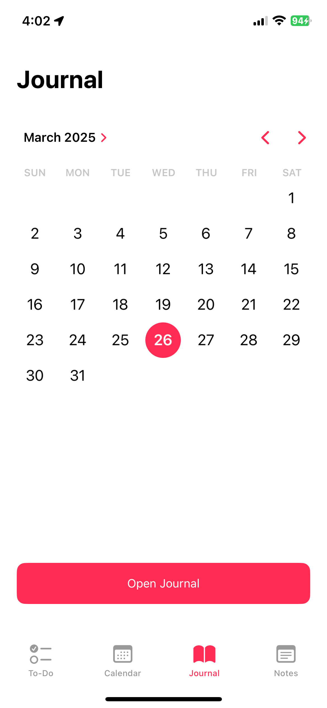
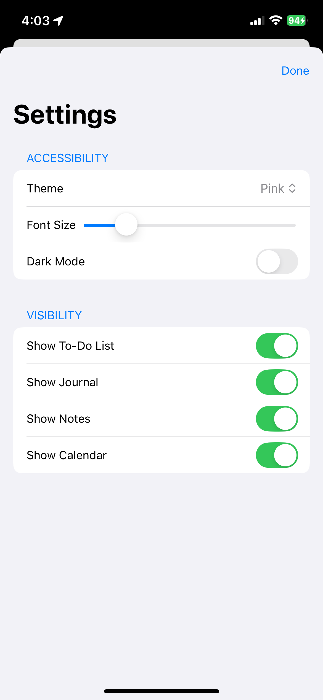
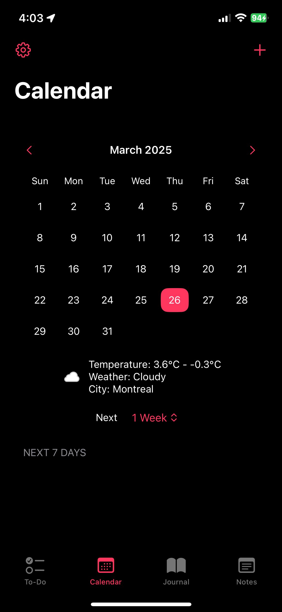
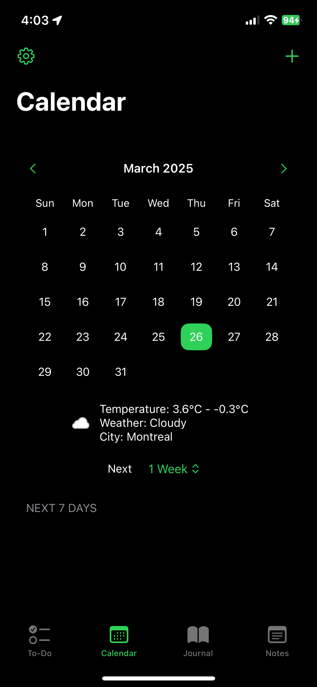

# AgendaMate

**AgendaMate** is a full-featured productivity and agenda app, combining:
- **To-Do List Management** (tasks, categories, reminders)
- **Calendar Integration** (create and edit events, schedule tasks)
- **Journal** (daily entries with optional images)
- **Notes** (standalone note management with sorting and searching)
- **Weather** (displays local weather forecast to help plan your day)

This project showcases a robust SwiftUI architecture with local data persistence, user notifications, and Calendar/Weather integrations.

---

## Screenshots

| Main TabView | To-Do List |
|--------------|------------|
|  |  |

| Add Task | Calendar |
|----------|----------|
|  |  |

| Notes | Journal |
|-------|---------|
|  |  |

| Settings |
|----------|
|  |

<details>
<summary>Optional Dark Mode Examples</summary>

| Main TabView (Dark) (Red) | Main TabView (Dark) (Green) |
|---------------------------|-----------------------------|
|  |  |

</details>

---

## Features

1. **To-Do List**  
   - Create tasks with priority, category, tags, reminders, subtasks, and comments  
   - Sort by title, due date, priority, tags, or drag-and-drop custom order  
   - Completed tasks are automatically archived (with optional time filtering)

2. **Calendar**  
   - Built-in monthly calendar picker to jump to specific days  
   - Sync tasks’ due dates to Apple Calendar (via `EventKit`)  
   - Create new events from within the app, edit them, or delete them

3. **Journal**  
   - Daily entries, each with an optional date/time picker  
   - Append images, comments, or tags  
   - Save to local storage or user defaults

4. **Notes**  
   - Create freeform notes (title, content, date)  
   - Sort notes by title, date, or custom order  
   - Inline searching by text, plus CSV import/export

5. **Weather**  
   - Automatically retrieves current location and displays a 3-day forecast  
   - Tapping or pulling new data refreshes the forecast

6. **Settings**  
   - Toggle the visibility of each major feature (To-Do, Journal, Notes, Calendar)  
   - Choose custom themes (color sets) and Dark Mode preference  
   - Adjust global font sizes for accessibility

---

## Tech Stack

- **SwiftUI** for the entire UI layer  
- **Combine / ObservableObject** for reactive data flow  
- **EventKit** for Apple Calendar integration  
- **UserNotifications** for local reminder notifications  
- **CoreLocation** + a custom `WeatherService` (using WeatherAPI) for geolocation and forecast data  
- **UserDefaults / JSON** for local data persistence (both tasks and notes)  
- **MVVM-ish** architecture with singletons/managers like `TaskManager`, `NotesManager`, etc.  
- **Xcode** 14+ / iOS 15+ compatible  

---

## Architecture Overview

- **`ContentView`**  
  - Main `TabView` controlling the major sections (To-Do, Calendar, Journal, Notes)  
  - Uses `@AppStorage` to show/hide each tab  
- **`TaskManager`**  
  - Singleton for creating, updating, deleting, sorting tasks  
  - Saves to `UserDefaults` in JSON format  
- **`CalendarManager`**  
  - Singleton that wraps `EventKit` for reading/writing calendar events  
- **`NotesManager`**  
  - Creates, reads, updates, and deletes note objects, stored in `UserDefaults`  
- **`LocationManager`**  
  - Fetches the user’s current location and triggers a `WeatherService` call  
- **`NotificationDelegate`**  
  - Manages local notifications while the app is in the foreground  

---

## Getting Started

1. **Requirements**  
   - Xcode 14 or later  
   - iOS 15 or later (Simulator or physical device)

2. **Build & Run**  
   1. Clone the repository:  
      ```bash
      git clone https://github.com/mickelsamuel/AgendaMate.git
      ```
   2. Open `AgendaMate.xcodeproj` (or `.xcworkspace` if present).  
   3. Select an iOS simulator or connected device.  
   4. Press **Run** (⌘R).

3. **Permissions**  
   - The app requests location, notification, and calendar permissions at launch.  
   - Approve these for full functionality.

---

_Made with ♥ in SwiftUI_
